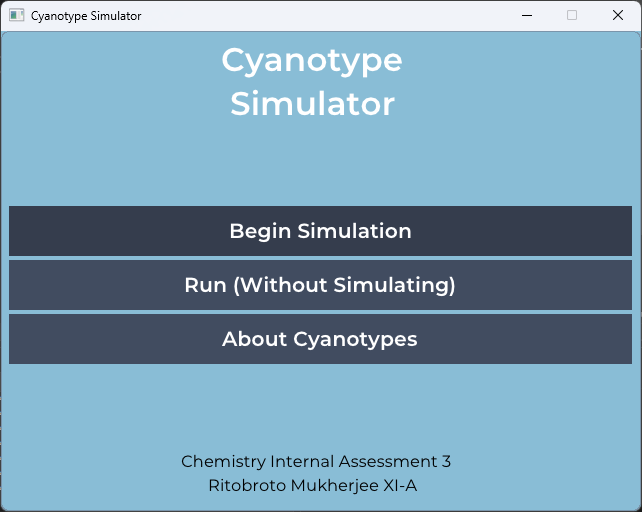
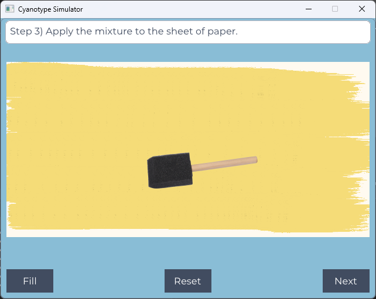
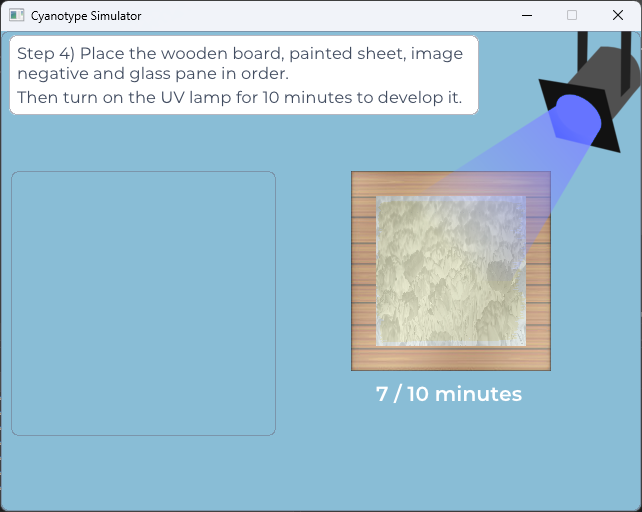
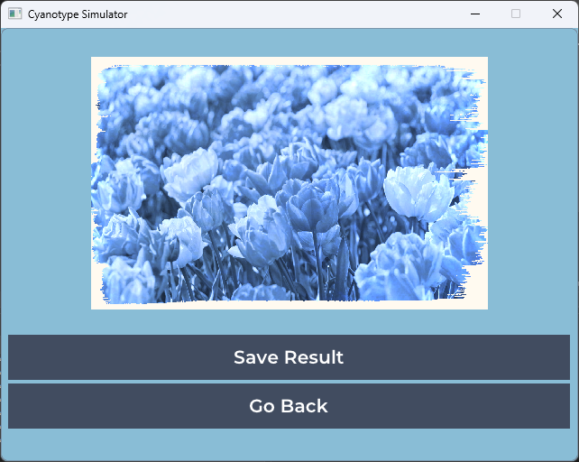

<a name="readme-top"></a>

<!-- PROJECT LOGO -->
<br />
<div align="center">
  <a href="https://github.com/DevChrome/CyanoSim">
    
  </a>

<h3 align="center">Cyanotype Simulator</h3>

  <p align="center">
    A simulation tool for creating beautiful cyanotypes from regular images
  </p>
</div>


<!-- TABLE OF CONTENTS -->
<details>
  <summary>Table of Contents</summary>
  <ol>
    <li>
      <a href="#about-the-project">About The Project</a>
      <ul>
        <li><a href="#built-with">Built With</a></li>
      </ul>
    </li>
    <li>
      <a href="#running-from-source">Running From Source</a>
      <ul>
        <li><a href="#prerequisites">Prerequisites</a></li>
        <li><a href="#instructions">Instructions</a></li>
      </ul>
    </li>
    <li><a href="#screenshots">Screenshots</a></li>
    <li><a href="#license">License</a></li>
  </ol>
</details>


<!-- ABOUT THE PROJECT -->
## About The Project

This is a little simulator that can be used to create cyanotype artwork from images. Built as a chemistry class assignment. Can convert a sample image, images from disk, or directly from the webcam.
<br><br>
Users can go through the program step by step and see how exactly a cyanotype is created chemically.

### Built With

* [SFML](https://www.sfml-dev.org/index.php)
* [Dear ImGui](https://github.com/ocornut/imgui)
* [ImGui-SFML](https://github.com/eliasdaler/imgui-sfml)

<!-- GETTING STARTED -->
## Running From Source

To get this project running locally from source, follow these steps:

### Prerequisites

* Visual Studio (>= 2019)

### Instructions

1. Clone the repo
   ```sh
   git clone https://github.com/DevChrome/CyanoSim.git
   ```
2. Open the project in Visual Studio and build.
3. Copy the assets folder to the output directory, and run.

<!-- USAGE EXAMPLES -->
## Screenshots




<!-- LICENSE -->
## License

Distributed under the MIT License. See `LICENSE.txt` for more information.


<p align="right">[<a href="#readme-top">Back To Top</a>]</p>
